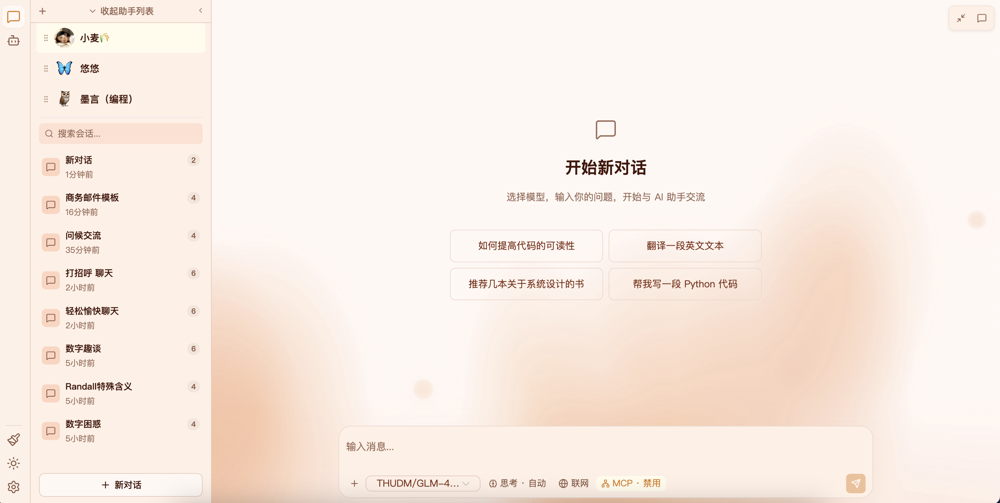

# Eddie

个人电脑 AI 助手 — 助手聊天 + 智能体 + 多模型支持

---

## ⚡ 快速开始

### 📥 下载预编译二进制

1. 前往 [Releases](https://github.com/wlizhi/eddie/releases) 下载最新版本
2. 解压后直接运行可执行文件
3. 浏览器打开（一般会自动打开） `http://localhost:11520`

> 无需安装 Java 或 Node.js，开箱即用。

### 📦 源码构建（需 Java 25 + Node.js 24）

```shell
# 1. 构建前端
cd frontend && npm install && npm run build
cd ..

# 2. 复制静态资源
cp -r frontend/dist/* ai-app/src/main/resources/static/

# 3. 打包并启动
mvn clean package -DskipTests
java -jar ai-app/target/ai-app-1.0.0.jar
```

### 🏗 AOT 编译（GraalVM Native Image）

编译为本地二进制，无需 JRE，启动更快、资源占用更低：

```shell
./build-native.sh
```

详情参见下方 [AOT 编译](#aot-compile) 章节。

---

## 🖼 截图




[//]: # (![智能体执行]&#40;screenshots/agent.png&#41;)
-->

---

## ✨ 功能特性

- **💬 多模型聊天** — 支持 DeepSeek / OpenAI 等兼容 API，对话中可随时切换模型
- **🤖 智能体** — 自主规划任务、逐步执行，集成 MCP 工具调用
- **🔌 MCP 工具扩展** — 通过 MCP 协议接入 WebSearch、WebFetch 等外部工具
- **🧠 模型记忆** — 短期对话记忆 + 中期压缩 + 长期摘要，全局缓存、持久化
- **🖥 纯本地运行** — 数据存储在本地 `~/.eddie/`，隐私安全

---

## 📦 源码构建（JAR）

构建可执行 JAR 包，依赖 JRE 25 运行。

```shell
# 1. 构建前端
cd frontend && npm run build

# 2. 复制前端产物到后端静态资源目录
rm -rf ai-app/src/main/resources/static/*
cp -r frontend/dist/* ai-app/src/main/resources/static/

# 3. 打包后端
mvn clean package -DskipTests
```

产物：`ai-app/target/ai-app-1.0.0.jar`

运行：

```shell
java -jar ai-app/target/ai-app-1.0.0.jar
```

> 也可使用 `mvn install -DskipTests` 将模块安装到本地 Maven 仓库。

---

<a id="aot-compile"></a>
## 🏗 AOT 编译（GraalVM Native Image）

编译为本地二进制文件，无需 JRE，启动快、资源占用低。需要所有依赖包全部兼容 AOT 注册，否则会编译失败或运行异常。

[GraalVM 下载链接](https://www.graalvm.org/downloads/#)

```shell
# 1. 构建前端
cd frontend && npm run build

# 2. 复制前端产物
rm -rf ai-app/src/main/resources/static/*
cp -r frontend/dist/* ai-app/src/main/resources/static/

# 3. AOT 预处理 + 本地编译
mvn clean
mvn install -Pnative -pl ai-app -am -DskipTests
mvn -Pnative native:compile -pl ai-app -DskipTests
```

> 可通过 `-Dnative-image.buildArgs` 传递额外参数给 `native-image`，例如限制内存：
> `-Dnative-image.buildArgs="-J-Xmx10g"`

产物：`ai-app/target/ai-app`

也可以直接使用项目根目录的一键构建脚本：

```shell
./build-native.sh
```

### Native Image 构建参数

配置在 [`ai-app/pom.xml`](ai-app/pom.xml) 的 `native` profile 中：

| 参数                                         | 说明          |
|--------------------------------------------|-------------|
| `-Os`                                      | 优化二进制体积     |
| `-H:GenerateDebugInfo=0`                   | 不生成调试信息     |
| `--initialize-at-build-time=...`           | 指定类在构建时初始化  |
| `--allow-incomplete-classpath`             | 允许不完整的类路径   |
| `--report-unsupported-elements-at-runtime` | 运行时报告不支持的元素 |

---

## 🧩 模块

| 模块                           | 包名                         | 说明                            |
|------------------------------|----------------------------|-------------------------------|
| [`ai-common`](ai-common)     | `cc.wlizhi.eddie.common`   | 公共定义：DTO、枚举、工具类               |
| [`ai-tools`](ai-tools)       | `cc.wlizhi.eddie.tools`    | 内置工具（WebSearch/WebFetch）注册与管理 |
| [`ai-settings`](ai-settings) | `cc.wlizhi.eddie.settings` | 全局设置：模型提供商、MCP、显示配置           |
| [`ai-memory`](ai-memory)     | `cc.wlizhi.eddie.memory`   | 记忆：短期、中期压缩、长期摘要、缓存            |
| [`ai-chat`](ai-chat)         | `cc.wlizhi.eddie.chat`     | 助手聊天：对话管理、上下文构建               |
| [`ai-agent`](ai-agent)       | `cc.wlizhi.eddie.agent`    | 智能体：任务规划、逐步执行                 |
| [`ai-app`](ai-app)           | `cc.wlizhi.eddie.app`      | 启动入口 + GraalVM 打包             |

---

## 🔧 技术栈

| 类别      | 技术                                         |
|---------|--------------------------------------------|
| 语言      | Java 25（GraalVM Native Image 打包）           |
| 后端框架    | Spring Boot 4.1.0 + Spring AI 2.0.0        |
| 数据库     | SQLite（`~/.eddie/eddie.db`）                |
| 持久层     | Spring JDBC Template（HikariCP 连接池，最大 1 连接） |
| AI 协议   | OpenAI 兼容协议（DeepSeek API / OpenAI API）     |
| MCP 客户端 | `spring-ai-starter-mcp-client`             |
| 前端      | Vue 3 + Vite + TypeScript                  |
| 构建工具    | Maven 多模块                                  |
| 打包方式    | JAR（源码构建）/ GraalVM Native Image（AOT 编译）    |

---

## 📐 项目结构

完整项目结构说明请查看 [`PROJECT_STRUCTURE.md`](PROJECT_STRUCTURE.md)。

---

## 🗄 数据库

- 文件路径：`~/.eddie/eddie.db`
- 建表脚本：[`ai-app/src/main/resources/schema.sql`](ai-app/src/main/resources/schema.sql)

---

## 🗺 开发路线图

### ✅ 已实现

- 💬 **多模型聊天** — 支持 DeepSeek / OpenAI 兼容 API，对话中可随时切换模型
- 💾 **会话管理** — 创建、删除、切换会话
- ⚙️ **通用设置** — 系统基本配置
- 🎨 **显示设置** — 界面主题与显示选项
- 🤖 **模型服务管理** — 模型提供商配置与默认模型选择
- 🔌 **MCP 服务管理** — MCP 工具服务的注册与配置

### 🚧 开发中

- 🧠 **多级记忆系统** — 短期对话记忆已完成，中期压缩与长期摘要开发中
- 🤖 **智能体** — 任务规划与逐步执行（基础框架开发中）

### 📋 计划中

- 🌐 **多语言支持**
- 🖼 **截图与展示优化**

---

## 📄 License

本项目基于 Apache License, Version 2.0 开源，详情见 [LICENSE](LICENSE) 文件。

© 2026 Eddie 作者。保留所有权利中明确授予的许可。
