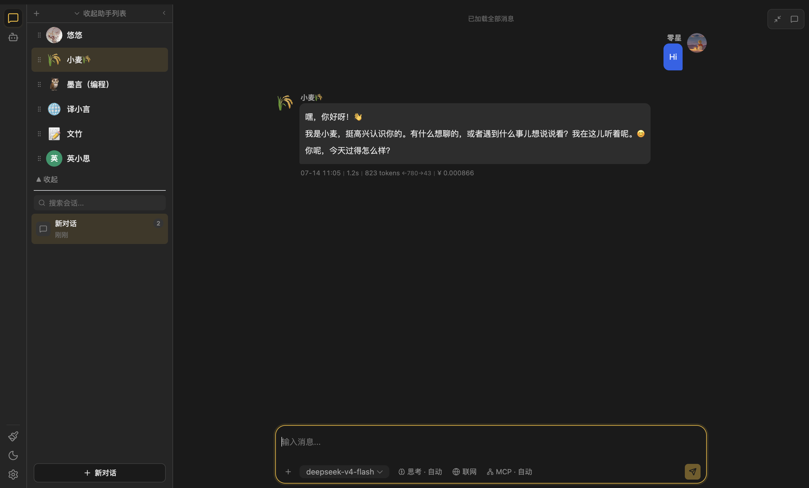
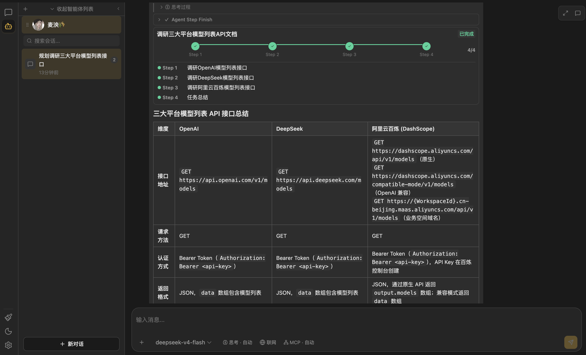
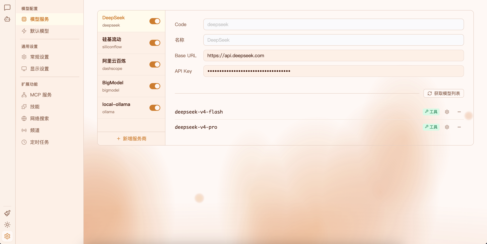

# Eddie

桌面 AI 助手 — 助手聊天 + 智能体 + 多模型支持

---

## 🖼 截图

<div style="margin: 16px 0;">

<div style="display: flex; overflow-x: auto; scroll-snap-type: x mandatory; scroll-behavior: smooth; -webkit-overflow-scrolling: touch; border-radius: 8px;">

<div id="slide-1" style="flex: 0 0 100%; scroll-snap-align: start;">
  
</div>

<div id="slide-2" style="flex: 0 0 100%; scroll-snap-align: start;">
  
</div>

<div id="slide-3" style="flex: 0 0 100%; scroll-snap-align: start;">
  
</div>

</div>

<div style="display: flex; justify-content: center; gap: 10px; margin-top: 12px;">
  <a href="#slide-1" style="width: 10px; height: 10px; border-radius: 50%; background: #999; display: inline-block; cursor: pointer; transition: background 0.2s;"></a>
  <a href="#slide-2" style="width: 10px; height: 10px; border-radius: 50%; background: #999; display: inline-block; cursor: pointer; transition: background 0.2s;"></a>
  <a href="#slide-3" style="width: 10px; height: 10px; border-radius: 50%; background: #999; display: inline-block; cursor: pointer; transition: background 0.2s;"></a>
</div>

</div>

---

## ⚡ 快速开始

### 🖥 本地安装包

前往 [Releases](https://github.com/wlizhi/eddie/releases) 下载对应系统的安装包：

- **macOS**：下载 `.dmg` 文件，打开后将 Eddie 拖入 Applications 文件夹即可
- **Windows**：下载 `.exe` 文件，双击运行安装向导
- **Linux**：下载 `.AppImage` 文件，赋予执行权限后直接运行

> **🍎 macOS 用户注意**：
> 首次打开 Eddie 时，系统可能提示应用无法验证。
> 请按以下步骤操作：
>
> 1. 打开 **系统设置 → 隐私与安全性**
> 2. 向下滚动到 **安全性** 区域
> 3. 点击 **"仍要打开"** 按钮
> 4. 在弹出的确认窗口中点击 **"打开"**
>
> 如提示"已损坏"，请在终端执行：
> ```bash
> xattr -dr com.apple.quarantine /Applications/Eddie.app
> ```

### 📥 下载预编译二进制

1. 前往 [Releases](https://github.com/wlizhi/eddie/releases) 下载最新版本
2. 解压后直接运行可执行文件
3. 浏览器打开（一般会自动打开） `http://localhost:11520`

> 无需安装 Java 或 Node.js，开箱即用。

### 📦 源码构建（需 Java 25 + Node.js 24）

```shell
./build-desktop.sh --jar
java -jar dist/eddie-app.jar
```

> 完整构建（含 Native + Electron）：`./build-desktop.sh --all`

---

## ✨ 功能特性

- **💬 多模型聊天** — 支持 DeepSeek / OpenAI 等兼容 API，对话中可随时切换模型
- **🤖 智能体** — 自主规划任务、逐步执行，集成 MCP 工具调用
- **📝 划词助手** — 任意程序页面，选中任意文本后弹出工具栏，支持翻译、解释、总结 AI 操作
- **🔌 MCP 工具扩展** — 通过 MCP 协议接入 WebSearch、WebFetch 等外部工具
- **🧠 模型记忆** — 短期对话记忆、智能体任务上下文记忆
- **🖥 纯本地运行** — 数据存储在本地 `~/.eddie/`，隐私安全

---

## 🔨 构建方式

### 📦 JAR 包构建

构建可执行 JAR 包，依赖 JRE 25 运行，最稳定、跨平台。

```shell
./build-desktop.sh --jar
```

产物：`dist/eddie-app.jar`

运行：

```shell
java -jar dist/eddie-app.jar
```

> 也可手动执行 `mvn clean package -DskipTests` 在 `ai-app/target/` 下生成 JAR，
> 或使用 `mvn install -DskipTests` 将模块安装到本地 Maven 仓库。

### 🏗 AOT 编译（GraalVM Native Image）

编译为本地二进制文件，无需 JRE，启动快（毫秒级）、资源占用低。

> 如需二次开发，请考虑兼容 AOT 注册，否则会编译失败或运行异常。

[GraalVM 下载链接](https://www.graalvm.org/downloads/#)

```shell
./build-desktop.sh --native
```

产物：`ai-app/target/eddie-app`

> 可通过 `-Dnative-image.buildArgs` 传递额外参数给 `native-image`，例如限制内存：
> `-Dnative-image.buildArgs="-J-Xmx10g"`

#### Native Image 构建参数

配置在 [`ai-app/pom.xml`](ai-app/pom.xml) 的 `native` profile 中：

| 参数                                         | 说明          |
|--------------------------------------------|-------------|
| `-Os`                                      | 优化二进制体积     |
| `-H:GenerateDebugInfo=0`                   | 不生成调试信息     |
| `--initialize-at-build-time=...`           | 指定类在构建时初始化  |
| `--report-unsupported-elements-at-runtime` | 运行时报告不支持的元素 |

### 🖥 本地安装包构建（Electron）

基于 Electron 将原生二进制打包为桌面安装包，提供原生桌面应用体验（系统托盘、自动启动等）。

```shell
./build-desktop.sh --electron
```

产物格式：

| 平台 | 安装包格式 |
|------|-----------|
| macOS | DMG |
| Windows | NSIS 安装程序 |
| Linux | AppImage 便携包 |

详细 CI 构建流程请查看 [`BUILD_WORKFLOW.md`](BUILD_WORKFLOW.md)。

### 📜 构建脚本说明

项目提供 [`build-desktop.sh`](build-desktop.sh) 一键构建脚本，支持多参数组合，适用于 macOS / Linux / Windows（Git Bash）。

| 参数           | 说明                                  |
|--------------|-------------------------------------|
| `--native`   | 仅构建原生二进制                            |
| `--jar`      | 仅构建 JAR 包                           |
| `--frontend` | 仅构建前端                               |
| `--electron` | 打包 Electron 桌面安装包（需先构建 Native + 前端） |
| `--clean`    | 清理所有构建产物                            |
| `--all`      | 完整构建（Native + JAR + 前端 + Electron）  |
| `--help`     | 参数文档                                |

常用组合示例：

```shell
./build-desktop.sh --clean --native --jar   # 清理后构建 Native + JAR
./build-desktop.sh --native --electron      # 构建 Native + 前端 + Electron
./build-desktop.sh --all                     # 完整构建
```

### 🔄 构建方式对比

| 方式 | 特点 | 适用场景       |
|------|------|------------|
| **JAR 包** | 最稳定，跨平台，需 JRE 25 | 通用部署、容器化   |
| **原生二进制** | 启动快（毫秒级），性能高，无需 JRE | 极致性能、低内存占用 |
| **本地安装包** | 使用简单，桌面集成好（系统托盘、自动启动） | 日常使用       |

---

## 🧩 模块

| 模块                           | 包名                         | 说明                            |
|------------------------------|----------------------------|-------------------------------|
| [`ai-common`](ai-common)     | `cc.wlizhi.eddie.common`   | 公共定义：DTO、枚举、工具类               |
| [`ai-tools`](ai-tools)       | `cc.wlizhi.eddie.tools`    | 内置工具（WebSearch/WebFetch）注册与管理 |
| [`ai-settings`](ai-settings) | `cc.wlizhi.eddie.settings` | 全局设置：模型提供商、MCP、显示配置           |
| [`ai-memory`](ai-memory)     | `cc.wlizhi.eddie.memory`   | 记忆：模型记忆、上下文处理及缓存相关            |
| [`ai-chat`](ai-chat)         | `cc.wlizhi.eddie.chat`     | 助手聊天：对话管理、上下文构建               |
| [`ai-agent`](ai-agent)       | `cc.wlizhi.eddie.agent`    | 智能体：任务规划、步骤执行                 |
| [`ai-assistant`](ai-assistant) | `cc.wlizhi.eddie.assistant` | 划词助手：选中文本 AI 操作处理            |
| [`ai-app`](ai-app)           | `cc.wlizhi.eddie.app`      | 启动入口 + GraalVM 打包             |

---

## 🔧 技术选型

| 类别      | 技术                                                     |
|---------|--------------------------------------------------------|
| 语言      | Java 25（GraalVM Native Image 打包）                       |
| 后端框架    | Spring Boot 4.1.0 + Spring AI 2.0.0                    |
| 数据库     | SQLite                           |
| 持久层     | Spring JDBC Template（HikariCP 连接池，最大 1 连接）             |
| AI 协议   | OpenAI 兼容协议（DeepSeek API / OpenAI API）                 |
| MCP 客户端 | `spring-ai-starter-mcp-client`                         |
| 前端      | Vue 3 + Vite + TypeScript                              |
| 构建工具    | Maven                                                  |
| 打包方式    | JAR（源码构建）/ GraalVM Native Image（AOT 编译）/本地安装包（Electron） |

---

## 📐 项目结构

完整项目结构说明请查看 [`PROJECT_STRUCTURE.md`](PROJECT_STRUCTURE.md)。

---

## 🗄 数据库

- 文件路径（存储在 `~/.eddie/data/` 目录下）：
  - 主数据库：`~/.eddie/data/eddie.db`
  - 智能体数据库：`~/.eddie/data/eddie-agent.db`
- DDL 建表脚本：
  - 主库：[`ai-app/src/main/resources/db/ddl/schema.sql`](ai-app/src/main/resources/db/ddl/schema.sql)
  - 智能体库：[`ai-app/src/main/resources/db/ddl/schema-agent.sql`](ai-app/src/main/resources/db/ddl/schema-agent.sql)

---

## 🗺 开发路线图

### ✅ 已实现

- 💬 **多模型聊天** — 支持 DeepSeek / OpenAI 兼容 API，对话中可随时切换模型
- 💾 **会话管理** — 创建、删除、切换会话
- ⚙️ **通用设置** — 系统基本配置
- 🎨 **显示设置** — 界面主题与显示选项
- 🤖 **模型服务管理** — 模型提供商配置与默认模型选择
- 🔌 **MCP 服务管理** — MCP 工具服务的注册与配置
- 📝 **划词助手** — 任意程序页面，选中文本弹出工具栏，支持翻译、解释、总结 AI 操作
- 🧠 **模型记忆**
- 🤖 **智能体**

### 🚧 规划中

- **🤖 智能体** — 优化任务编排与记忆策略，提升模型推理与执行能力
- **💬 助手聊天** — 打磨页面交互体验，重构后端代码结构，完善容错与边界处理
- **🔧 工具** — 更多内置工具增强模型边界能力

---

## 📄 License

本项目基于 Apache License, Version 2.0 开源，详情见 [LICENSE](LICENSE) 文件。

© 2026 Eddie 作者。保留所有权利中明确授予的许可。
